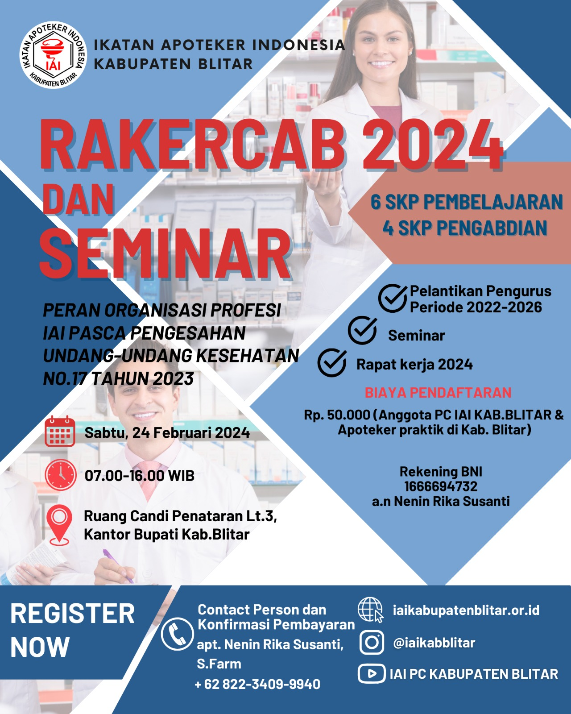

Blitar, Jawa Timur – Ikatan Apoteker Indonesia (IAI) Cabang Kabupaten Blitar akan mengadakan kegiatan bertajuk **"Pelantikan Pengurus Cabang Ikatan Apoteker Indonesia Kabupaten Blitar Periode 2022 – 2026 Dan Rapat Kerja, Serta Seminar"** pada hari Sabtu, 24 Februari 2024. Acara ini akan berlangsung di Ruang Candi Penataran Lantai 3 Kantor Bupati Kabupaten Blitar Jl. Kusuma Bangsa, No. 60, Kec. Kanigoro, Kab. Blitar, Jawa Timur.

Kegiatan ini wajib diikuti oleh seluruh anggota IAI Kabupaten Blitar dengan beberapa sasaran utama, yaitu:

1. Pelantikan Pengurus Cabang Ikatan Apoteker Indonesia Kabupaten Blitar periode 2022 – 2026
2. Seminar dengan Tema **"Peran Organisasi Profesi Ikatan Apoteker Indonesia Pasca Pengesahan Undang-Undang Kesehatan No 17 Tahun 2023"**.
3. Rapat kerja seluruh anggota Ikatan Apoteker Indonesia Pengurus Cabang Kabupaten Blitar tahun 2024

**Pendaftaran:**

* **Biaya Pendaftaran Rp. 50.000,-** (Anggota PC IAI Kabupaten Blitar & Apoteker Praktik di Kab. Blitar)
* **Rek BNI 1666694732 a.n Nenin Rika Susanti [WA Konfirmasi Pembayaran +62 822-3409-9940](https://wa.me/6282234099940)**
* Peserta mengajukan pendaftaran kegiatan ini di aplikasi **[SIAP](https://apoteker.or.id/#!/access/)**.

**Rangkaian Acara:**

* **07.00 – 07.50 WIB**: Registrasi
* **08.00 – 08.30 WIB**: Pembukaan
* **08.30 – 09.00 WIB**: Pelantikan Pengurus Cabang Ikatan Apoteker Indonesia Kabupaten Blitar Periode 2022 – 2026
* **09.00 – 11.00 WIB**: Seminar
* **11.00 – 11.50 WIB**: Presentasi Bidang, Persiapan Raker
* **12.10 – 13.00 WIB**: *Ishoma*
* **13.00 – 14.00 WIB**: Sidang Pleno 1
* **14.00 – 15.30 WIB**: Sidang Pleno 2
* **15.30 – 15.45 WIB**: Penutup

- - -

***Unduh SK SKP*** : [SK-SKP-000030/PD-IAI/SIAP/Jawa Timur/II/2024](sk-skp-000030⁄pd-iai⁄siap⁄jawa-timur⁄ii⁄2024.pdf "File")