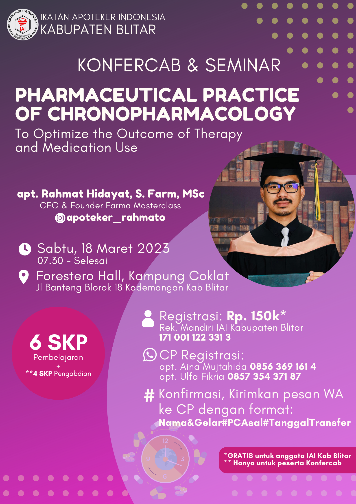

Pengurus Cabang Ikatan Apoteker Indonesia (IAI) Kabupaten Blitar akan mengadakan kegiatan Seminar dan Konferensi Cabang (Konfercab) pada tanggal 18 Maret 2023. Kegiatan ini bertujuan untuk meningkatkan pemahaman apoteker dalam praktik farmasi dan untuk memilih ketua baru yang akan menggantikan apoteker Wisnu Winoto S.Farm yang telah menjabat selama dua periode.

Narasumber dalam Seminar ini adalah apoteker Rahmat Hidayat S.Farm, MSc CEO dan _Founder_ dari Farma Masterclass, seorang Apoteker sekaligus konten kreator, yang akan membahas tema **_"Pharmaceutical Practice of Chronopharmacology to optimize the outcome of therapy and medication"_**. Topik ini sangat penting bagi apoteker karena menyangkut praktik farmasi dan penggunaan obat-obatan yang tepat pada waktu yang tepat untuk memaksimalkan hasil terapi.

Selain Seminar, Konfercab juga akan diadakan setelah Seminar selesai. Konfercab bertujuan untuk memilih ketua baru yang akan menggantikan apoteker Wisnu Winoto S.Farm yang telah menjabat selama dua periode. Kegiatan ini sangat penting untuk memastikan bahwa IAI Kabupaten Blitar terus berjalan dengan baik dan dikelola oleh orang yang tepat.

Kegiatan ini diharapkan dapat membantu meningkatkan kualitas praktik farmasi di Kabupaten Blitar dan memperkenalkan pengetahuan terbaru dalam praktik farmasi kepada para apoteker. Dalam era yang serba cepat dan dinamis seperti sekarang, kegiatan seperti ini sangat penting untuk memastikan bahwa para apoteker tetap memperoleh pengetahuan terbaru dan praktik farmasi yang tepat untuk memaksimalkan hasil terapi pasien.

Kami mengundang seluruh apoteker di Kabupaten Blitar untuk menghadiri kegiatan Seminar dan Konfercab ini. Dengan menghadiri kegiatan ini, apoteker akan memperoleh pengetahuan terbaru dan bergabung dalam pemilihan ketua baru untuk memastikan kelancaran pengelolaan IAI Kabupaten Blitar. Semoga kegiatan ini dapat berjalan dengan lancar dan memberikan manfaat yang besar bagi seluruh apoteker dan masyarakat Kabupaten Blitar.
