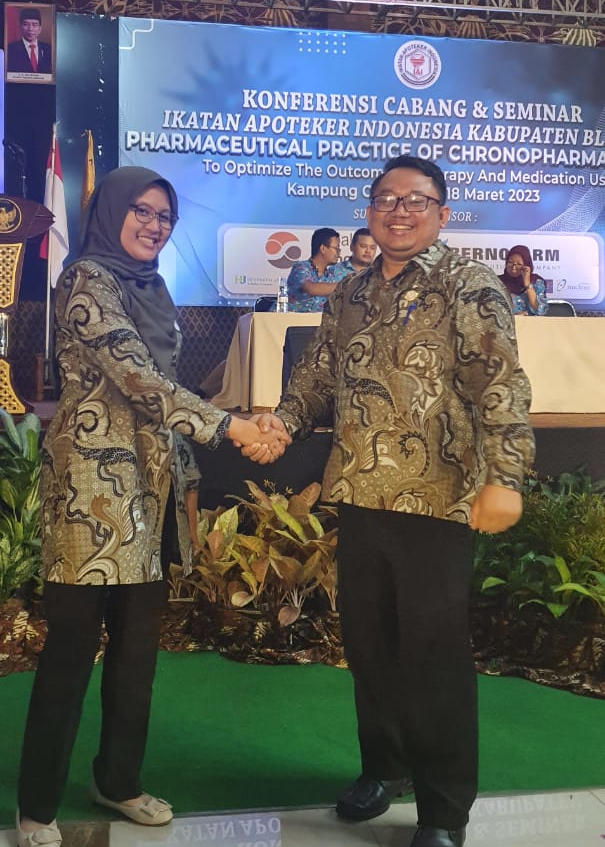

_Assalamualaikum Warahmatullahi Wabarakatuh,_

Saya, **apoteker Wisnu Winoto S.Farm**, selaku Ketua Ikatan Apoteker Kabupaten Blitar periode 2019-2023, ingin menyampaikan beberapa pesan dan nasehat untuk seluruh anggota Ikatan Apoteker Kabupaten Blitar, terutama kepada ketua terpilih, sejawat **apoteker Daning Irawati, S.Farm** dan jajaran pengurus yang akan segera dibentuk.

Sebelumnya, saya ingin mengucapkan terima kasih yang sebesar-besarnya kepada seluruh jajaran pengurus Ikatan Apoteker Kabupaten Blitar periode 2019-2023 atas kerjasama, dukungan, dan perjuangan yang luar biasa selama empat tahun terakhir. Tanpa kerjasama dan dukungan dari mereka, IAI Kabupaten Blitar tidak akan mencapai keberhasilan yang telah diraih saat ini.

Selanjutnya, saya juga ingin mengucapkan terima kasih kepada seluruh panitia yang telah sukses menyelenggarakan acara seminar dan Konfercab pada tanggal 18 Maret 2023 kemarin. Acara tersebut merupakan wadah bagi kita untuk memperkuat silaturahmi, memperdalam ilmu pengetahuan, serta memperbaharui semangat perjuangan kita dalam menghadapi tantangan ke depan.

Saat ini, kita telah mengalihkan amanah kepemimpinan kepada ketua terpilih dan jajaran pengurus yang akan segera dibentuk. Saya ingin mengucapkan selamat bertugas dan mengemban amanah baru. Semoga amanah yang diberikan dapat dijalankan dengan baik demi tercapainya tujuan bersama.

Pertama-tama, saya ingin menekankan bahwa menjadi pengurus adalah sebuah pengabdian. Semoga segala pengabdian sejawat dapat mendapatkan ganjaran dari Allah SWT yang berlimpah dan terus mengalir ke dalam kehidupan kita sehari-hari.

Kedua, mari kita hidup dan menjunjung tinggi Ikatan Apoteker Indonesia (IAI) sebagai wadah kita dalam mengembangkan diri dan berkontribusi bagi masyarakat. Namun, **jangan sampai kita hidup dari IAI**. Mari berjuang dan bekerja secara profesional untuk mendapatkan sumber penghidupan yang halal dan berkualitas.

Ketiga, menjadi pengurus bukanlah perkara mudah. Dibutuhkan kesabaran, kejujuran, dan rasa rendah hati untuk menghadapi berbagai tantangan yang akan dihadapi. Jangan biarkan _ego_ pribadi menghalangi langkah kita dalam menjalankan tugas dan tanggung jawab sebagai pengurus. Jaga hubungan yang baik dengan anggota dan berusaha untuk menjadikan mereka sejahtera.

Demikianlah pesan dan nasehat dari saya untuk ketua terpilih dan jajaran pengurus yang akan segera dibentuk. Semoga kita semua dapat terus memperkuat kebersamaan, menjaga semangat perjuangan, serta mengemban amanah kepemimpinan dengan penuh tanggung jawab dan integritas.

_Wassalamualaikum Warahmatullahi Wabarakatuh._
